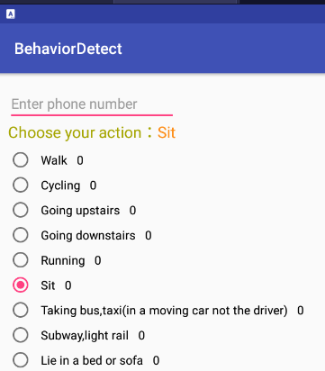

A. For the HHAR dataset please refer to "Smart devices are different: Assessing and mitigating mobile sensing heterogeneities for activity recognition." 	
Dataset available here: http://archive.ics.uci.edu/ml/datasets/heterogeneity+activity+recognition

B. For the USC-HAD dataset please refer to "USC-HAD: a daily activity dataset for ubiquitous activity recognition using wearable sensors"
Dataset available at http://sipi.usc.edu/had/

C. Format of the collected dataset: (available at https://drive.google.com/file/d/1iRtZELeLhm5eIeuDDaegdfFyMlYvvBy7/view?usp=sharing)
  1. Every txt file contains data from only one user. Each line of a text file represents one sample with "\t" as a delimiter. 
  2. Each line contains, uid, act_type, acc_data, gyro_data. 
  3. acc and gyro data are string with the "," delimiter. Both Acc and Gyro have three axies: x,y,z. The data is arranged as: acc = "x1,y1,z1,x2,y2,z2,.... " gyro = "x1,y1,z1,x2,y2,z2,.... ". 

Details on collected dataset:
1. APP used to collect the data. 

Label and action in the txt files: \
1 -- Walk \
2 -- Bike \
3 -- Upstairs \
4 -- Downstairs \
5 -- Run \
6 -- sit (ignored) \
7 -- bus \
8 -- subway \
9 -- lying (ignore) \
Therefore we encode the activity with the following dict: 
``action_dict = {"1": 0, "2": 1, "3": 2, "4": 3, "5": 4, "6": 5, "7": 6, "8": 7}``